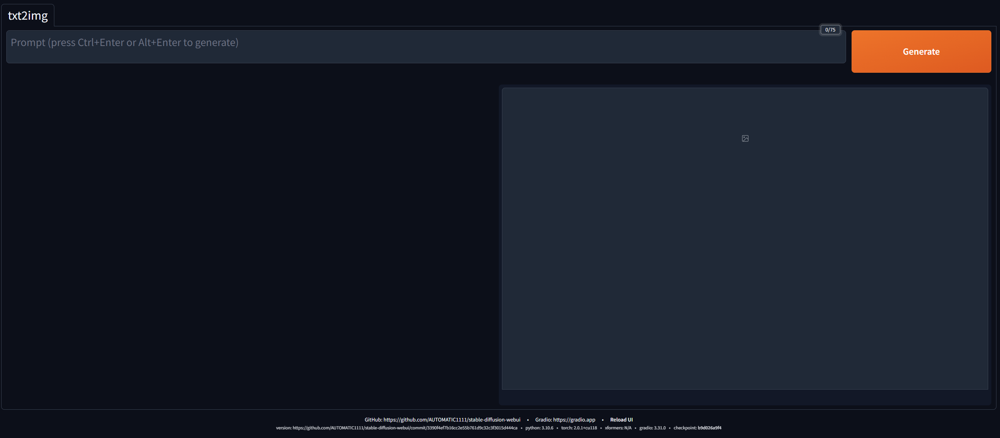

# Stable Diffusion Public Demo Extension

This extension allows to turn the [AUTOMATIC1111/stable-diffusion-webui](https://github.com/AUTOMATIC1111/stable-diffusion-webui)
into simple tech demo for public which exposes only the prompt, and keeps all the other configuration hidden.
It is meant to be run in Windows Kiosk mode so users could not tamper with the program.

If you want to use it for public on public place, it's recommended to be used along with 
[DiffusionDefender](https://github.com/WildBanjos/DiffusionDefender) which lets you blacklist some words from the prompt
(while allowing these words in the hard-coded negative prompt).

## Installation

Install it using the web UI, which is the simplest way.

## Features

This extension performs following modifications:
- It replaces the original footer with different one, most of the contents is the same, but the links are not clickable,
which is important for Kiosk mode.
- It hides the negative prompt from the UI, but keeps it in the generated images.
- Enlarges the important texts 2x so people can see it better.

The CSS for hiding the original footer and disabling on-change link in js are enabled together with the extension.
Setting custom html footer and hiding the negative prompt is toggleable by config parameters.

It also adds feature for easy sharing of generated images. This extension provides functionality for generating QR code
for every generated image, next to the image, which points to the image path in output directory under some URL.
If you run basic webserver for serving static content inside the `outputs/txt2img-images`, the QR code will 
point to URL of this webserver, if properly configured.

If needed, the js and css can be also toggleable, because it can be added as gradio element before or after
the original css, making it more configurable. Because every script class is re-created after css and js reload, 
changing/toggling the css, html and js there might be viable.

## Configuration

The extension adds following options:
- `hide_negative_prompt`, default true, if true, hides the negative prompt in web UI
- `add_qr_code`, adds QR code after each image, pointing to URL in image
- `static_server_uri`, base url for the QR code
- `hide_footer_links`, if true, shows footer without links

In order to get the resulting UI:


you need to set the config files accordingly and run the web UI with 
```shell
set COMMANDLINE_ARGS=--theme dark --ui-settings-file=config-demo.json --ui-config-file=ui-config-demo.json --hide-ui-dir-config --freeze-settings
```

Example config files are in [config-demo](sample_configs/config-demo.json) and [ui-config-demo](sample_configs/ui-config-demo.json).

The `--freeze-settings` (among other stuff, like freezing the settings) hides the option to select the model.
The `--hide-ui-dir-config` hides the button for the output directory.

When setting the `--ui-config-file`, set replace the `*/visible": true` with `*/visible": false` everywhere except of the
```json
{
    "txt2img/Prompt/visible": true,
    "txt2img/Generate/visible": true,
    "txt2img/Return to homepage/visible": true
}
```
and set the negative prompt correctly. The [ui-config-demo](sample_configs/ui-config-demo.json) shows the negative prompt
and other values which were proven to work well in the demo.
In `--ui-settings-file` set the model, its hash, vae correctly and of course the parameters in this extension.

The sammple configs are not updated and will get out of date, they are to demonstrate the relevant custom values.
After cloning the [AUTOMATIC1111/stable-diffusion-webui](https://github.com/AUTOMATIC1111/stable-diffusion-webui), the
config files are not present, in order to generate their current version, run the web UI, go to Setting and there click
on `Apply settings`, which will write the settings to the filesystem.
